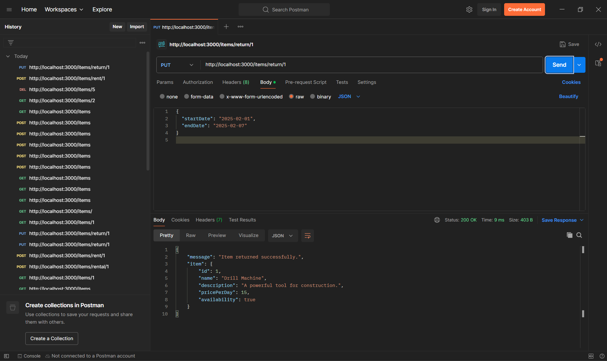
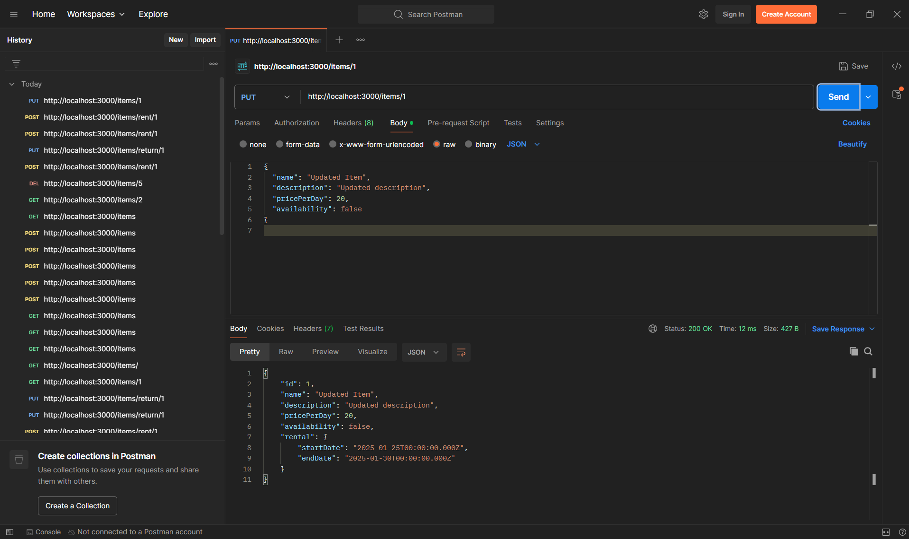

# **Peer-to-Peer Rental Platform Backend API**

## **Description**

This is a simple API for a peer-to-peer rental platform where users can list, rent, and return items. The backend is built with Node.js and Express, with an in-memory database (an array) to store the rental items. This API supports the following actions:

1. **List items** available for rent.
2. **Add items** to the platform.
3. **Rent items** for a specified date range.
4. **Return items** to make them available again.
5. **Delete items**.
6. **Update item details**.

## **API Endpoints**

### **1. List all items**
- **URL**: `/items`
- **Method**: `GET`
- **Description**: Fetch all rental items.
- **Response**: A JSON array of rental items.

**Example Request**:
```bash
GET http://localhost:3000/items


### **2. Add items**
**URL**: `/items`
- **Method**: `POST`
- **Description**: Add a new rental item to the platform.
- **Request Body**:
  - `name` (string): Name of the item.
  - `description` (string): A description of the item.
  - `pricePerDay` (float): Rental price per day.
  - `availability` (boolean): Whether the item is available for rent.
  

**Example Request**:
```bash
POST http://localhost:3000/items

### **3. Rent an item**
- **URL**: `/items/rent/:id`
- **Method**: `POST`
- **Description**: Rent an item for a specified date range.
- **URL Params**:
  - `id` (integer): The ID of the rental item to rent.
- **Request Body**:
  - `startDate` (string): The start date of the rental (ISO format).
  - `endDate` (string): The end date of the rental (ISO format).

**Example Request**:
```bash
POST http://localhost:3000/items/rent/1
  

### **4. Return an item**
- **URL**: `/items/return/:id`
- **Method**: `POST`
- **Description**: Mark an item as returned and make it available again.
- **URL Params**:
  - `id` (integer): The ID of the rental item to return.
- **Response**: A JSON object confirming the item has been returned and is available again.

**Example Request**:
```bash
POST http://localhost:3000/items/return/1
  

### **5. Delete an item**
- **URL**: `/items/:id`
- **Method**: `DELETE`
- **Description**: Delete an item from the platform.
- **URL Params**:
  - `id` (integer): The ID of the rental item to delete.
- **Response**: A JSON object confirming the item has been deleted.

**Example Request**:
```bash
DELETE http://localhost:3000/items/1
  

### **6. Update item details**
- **URL**: `/items/:id`
- **Method**: `PUT`
- **Description**: Update an item by ID.
- **URL Params**:
  - `id` (integer): The ID of the rental item to update.
- **Request Body**:
  - `name` (string, optional): New name for the item.
  - `description` (string, optional): New description for the item.
  - `pricePerDay` (float, optional): New rental price per day.
  - `availability` (boolean, optional): New availability status.
- **Response**: A JSON object with the updated item details.

**Example Request**:
```bash
PUT http://localhost:3000/items/1
  


